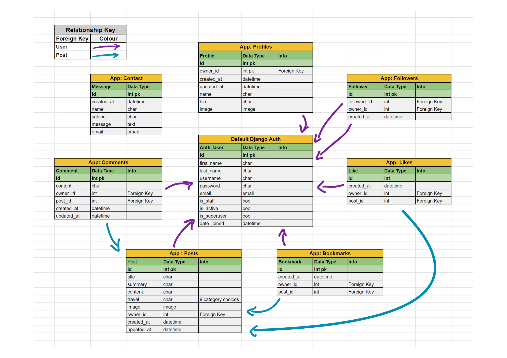
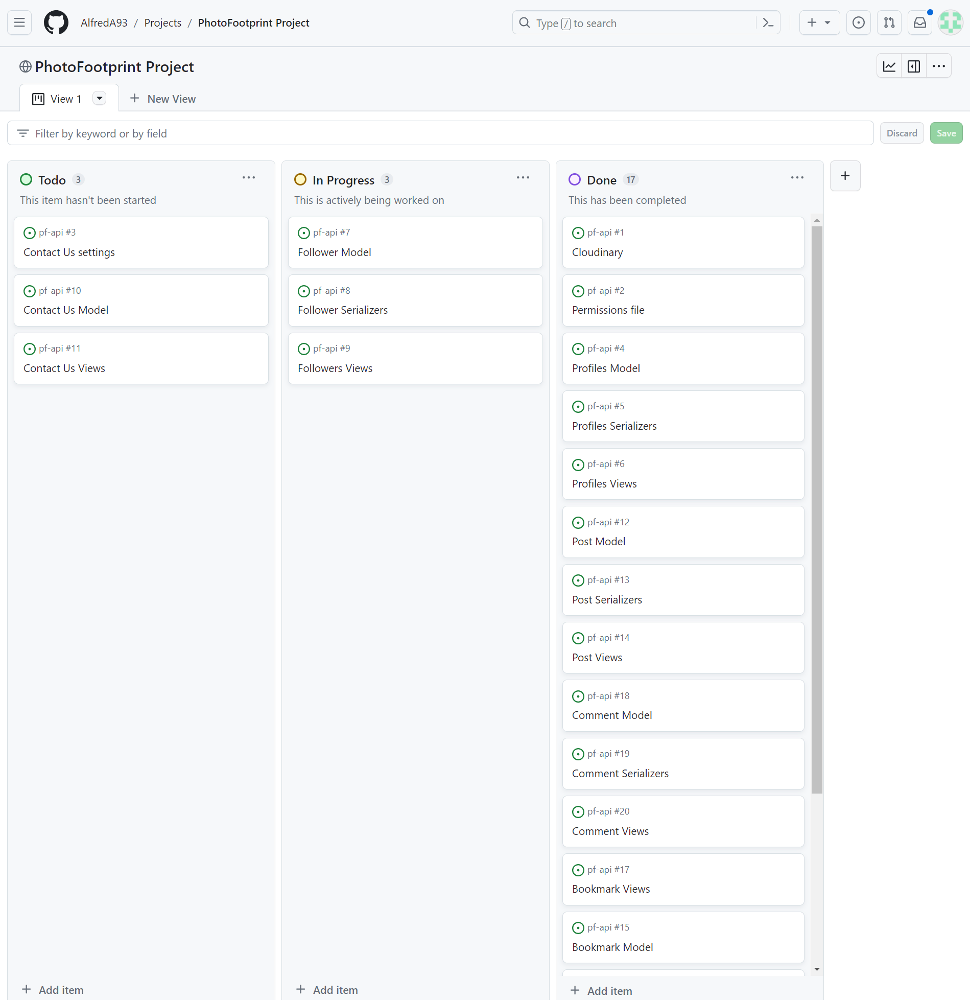

# PhotoFootprint
## Introduction
## Contents
- [Overall Project Goals](#overall)
- [Frontend](#frontend)
  - [Design](#design)
    - [Agile](#agile)
    - [Project Goal](#project-fe)
    - [Scope](#scope-fe)
    - [Structure](#structure-fe)
    - [User Stories](#user-stories)
  - [Features](#features)
    - [Future Features](#future)
  - [Deployment](#deploy)
  - [Testing](TESTING.md)
  - [Libraries Used](#libs)
  - [Credits](#creds)
    - [Code](#code-fe)
    - [Helpsheets, Documentation and Useful Resources](#helpsheets)
  - [Techonology](#tech)
  - [Media](#media-fe)
- [Backend](#backend)
  - [Design](#design-be)
    - [ERD](#erd)
    - [Agile](#agile-be)
    - [Tasks](#tasks)
    - [Project Goal](#goals-be)
    - [Structure](#structure-be)
  - [Deployment](#deploy-be)
  - [Testing](TESTING.md)
  - [Libraries Used](#libs-be)
  - [Credits](#cred-be)
    - [Code](#code-be)
    - [Helpsheets, Documentation and Useful Resources](#helps-be)
  - [Techonology](#tech-be)
  - [Media](#media-be)
- [Overall Learning Outcomes](#outcomes)
- [Acknowledgements](#acknow)

# Overall Project Goals 
# Frontend 

## Design 

### Agile 

### Project Goal 

### Scope 

### Structure 

### User Stories 

| Milestone |Title |Description	| Label |
|---------|------|-------------|-------|
|Nav Bar Front-End|User Story - Nav Bar |As a **user** I can **see the navbar consistently across all pages** so that **I can easily navigate around the site**|Must Have|
|Nav Bar Front-End|Page Routing|As a **user** I can **quickly switch between content** so that **I can see content change without having to refresh the page**|Must Have|
|Nav Bar Front-End|User Story - Account Sign Up|As a **user** I can **create an account** so that **I can join in the applications community and share my own posts/comments**|Must Have|
|Nav Bar Front-End|User Story - Account Sign In|As a **user** I can **sign in** so that **use the full functionality of the application**|Must Have|
|Nav Bar Front-End|User Story - Account Logged In|As a **user** I can **see my current logged in status** so that **log in or out if necessary**|Must Have|
|Nav Bar Front-End|User Story - Account - Refresh Tokens|As a **user** I can **stay logged in until i click log out** so that **I can come back to the site with more ease**|Must Have|
|Nav Bar Front-End|User Story - Nav Bar Conditional Rendering|As a **user** I can **see different navbar options depending if i’m logged in or not** so that **I can interact with the content or sign in/up if needed**|Must Have|
|Nav Bar Front-End|User Story - Profile Image|As a **user** I can **set a profile image** so that **it's easy to differentiate between users**|Must Have|
|Nav Bar Front-End|User Story - Contact Us|As a **user** I can **see a contact us button** so that **interact directly with the app team to ask any questions or share views**|Could Have|
|Creating, Liking & Bookmarking Posts Front-End|User Story - Create posts| As a **logged in user** I can **create posts** so that **join in with the community**|Must Have|
|Creating, Liking & Bookmarking Posts Front-End|User Story - View a post|As a **user** I can **click on a post to see a more detailed view of it** so that **learn more about it**|Must Have|
|Creating, Liking & Bookmarking Posts Front-End|User Story - Like a post|As a **logged in user** I can **like a post** so that **show which posts interest me**|Must Have|
|Creating, Liking & Bookmarking Posts Front-End|User Story - Bookmark a post|As a **logged in user** I can **bookmark a post** so that **save it to view later**|Should Have|
|The Posts (& Feed) Page(s) Front-End|User Story - View up to date posts|As a **user** I can **see the most recent posts first** so that **I can check on the latest posts**|Must Have|
|The Posts (& Feed) Page(s) Front-End|User Story - Search Filtering|As a **user**, I can **search through posts with a search bar**, so that **I can find specific posts**|Must Have|
|The Posts (& Feed) Page(s) Front-End|User Story - View bookmarked posts|As a logged in **user** I can **see posts that I have booked** so that **I have an area for saved posts**|Should Have|
|The Posts (& Feed) Page(s) Front-End|User Story - View Followed user posts|As a **logged in user** I can **see posts from users that I follow** so that **I can see their most recent posts easily**|Must Have|
|The Posts (& Feed) Page(s) Front-End|User Story - Infinite scroll|As a **user** I can **scroll through images easily and simply** so that **the website doesn’t need unnecessary interaction**|Must Have|
|The Post Page Front-End|User Story - Post page|As a **user** I can **view a post’s page** so that **read more about the post and comment on it**|Must Have|
|The Post Page Front-End|User Story - Edit/Delete post|As a **post owner** I can **delete/edit the details of the post** so that **I can have control over my content**|Must Have|
|The Post Page Front-End|User Story - Create comments|As a **logged in user** I can **comment on a post** so that **I can share my thoughts about the post**|Must Have|
|The Post Page Front-End|User Story - Comment timestamps|As a **user** I can **see a timestamp on each comment** so that **I can see how recent each comment was**|Must Have|
|The Post Page Front-End|User Story - View comments|As a **user** I can **read comments** so that **see what other users think**|Must Have|
|The Post Page Front-End|User Story - Delete comments|As a **comment owner** I can **delete a comment** so that **I can control my comments on posts**|Must Have|
|The Post Page Front-End|User Story - Edit comments|As a **comment owner** I can **edit my comment** so that **I can change it whenever I choose**|Must Have|
|The Profile Page Front-End|User Story - Profile page|As a **user** I can **see other user profiles** so that **see who uses the app**|Must Have|
|The Profile Page Front-End|User Story - Most followed profiles|As a **user** I can **see the most followed profiles** so that **I can see popular profiles**|Must Have|
|The Profile Page Front-End|User profile - stats|As a **user** I can **see user specific statistic about: bio, number of posts, followers and following** so that **I can learn more about them**|Must Have|
|The Profile Page Front-End|User Story - Follow/Unfollow a user|As a **logged in user** I can **follow/unfollow other users** so that **change my own content feed and keep up to date with the content I want**|Must Have|
|The Profile Page Front-End|User Story - See all posts by specific profile|As a **user** I can **see all posts created by specific profile** so that **interact with their content and/or follow/unfollow them**|Must Have|
|The Profile Page Front-End|User Story - Edit profile|As a **logged in user** I can **edit my own profile** so that **I can change my data when I choose to**|Must Have|
|The Profile Page Front-End|User Story - Update username and password|As a **logged in user** I can **update my login details** so that **keep my data secure and in my own control**|Must Have|

## Features 

- Feature 1
- Feature 2
- Feature 3
- Contact Us Email
  - 

### Future Features 

- Add a map which shows the journey in where the user has travelled.
- Feature 2
- Feature 3

## Deployment 

## [Testing](TESTING.md)
All testing and code validation is shown in the seperate [TESTING.md](TESTING.md) file.

## Libraries Used 

## Credits 

### Code 

### Helpsheets, Documentation and Useful Resources 

### Technology 
### Media 

# Backend - PhotoFootprint API 

- Welcome Message Image

## Design (backend) 
### ERD 

### Agile (backend) 
To manage the tasks and user stories on this project I used GitHub Projects. For the backend I wrote Milestones for each app, with issues (tasks) to be completed within each milestone, which could then be 'closed' when each was completed. Here is a link to the [PhotoFootprint GitHub Project](https://github.com/users/AlfredA93/projects/6) and [PhotoFootprint Milestones](https://github.com/AlfredA93/pf-api/milestones)

### Tasks 
| Milestone |Title |Description	| Label |
|---------|------|-------------|-------|
| PhotoFootprintAPI |Cloudinary | Add Cloudinary settings to settings.py| Must Have |
| PhotoFootprintAPI |Permissions file |	Create permissions file for IsOwnerOrReadOnly class used in serializer permission_classes |	Must Have |
| PhotoFootprintAPI | Contact settings | Add constants to settings.py that enable Contact Us App to function. | Could Have |
| Profiles API| Profiles Model | Create Profile model, related to Foreign Key User. Include image, bio, name, owner (FK), created_at, updated_at fields. | Must Have |
|Profiles API | Profiles Serializers | Create ProfileSerializer class with 'owner' as ReadOnlyField and 'is_owner' as SerializerMethodField	| Must Have |
|Profiles API | Profiles Views | Create ProfileList and ProfileDetail class views to show a list of profiles and the detailed profile respectively | Must Have |
|Followers API App | Follower Model | Create Follower Model with fields owner, followed and created_at. 'owner' with related_name 'following'. 'followed' with related_name 'followed' Both owner and followed are FK from User model. Include unique_together in the Meta class to help stop follow duplication | Must Have |
|Followers API App |Follower Serializers |Create FollowerSerializer class with 'owner' and 'followed_name'as ReadOnlyField(s). Add duplication validation |	Must Have |
|Followers API App|Followers Views |Create FollowerList and FollowerDetail views. Add permission_classes to only allow users to change their own follow data |Must Have |
|Contact API App |Contact Model| Create a Contact Model with name, email and message fields. Add save function and send_mail function from django.core.mail https://docs.djangoproject.com/en/3.2/topics/email/ |Could Have|
|Contact API App |Contact Views| Create ContactAPIView with basic post function. Add send_mail() function to view.	Could Have
|Contact API App|Contact Serializers| Create basic serializer to view all fields |Could Have |
|Posts API App|	Post Model| Create Post model, related to Foreign Key User. Include title, summary, content, travel, owner (FK), created_at, updated_at fields. Travel field should be a choice between the following options - Bicycle, Boat, By Foot, Combustion Engine Car, Electric Car, Multiple, Other, Plane, Train.	| Must Have |
|Posts API App|	Post Serializers|Create PostSerializer class with 'owner' as ReadOnlyField and 'is_owner' as SerializerMethodField. profile_id and profile_image as ReadOnlyField(s). Add image validation to the serializer, file size no larger than 2MB.|Must Have|
|Posts API App|Post Views|Create PostList and PostDetail class views to show a list of profiles and the detailed profile respectively. Use permission_classes to allow users to only update/delete their own posts. Add comment count, like count, filter and search capabilities to PostList|Must Have|
|Bookmarks API App|	Bookmark Model|	Create Bookmark Model with fields owner (FK - User), post (FK - Post) and created_at. 'post' with related_name 'bookmarks.' Include unique_together in the Meta class to help stop duplication|Should Have|
|Bookmarks API App|Bookmark Serializers|Create BookmarkSerializer class with 'owner' as ReadOnlyField. Add duplication validation|Should Have|
|Bookmarks API App|Bookmark Views|Create BookmarkList and BookmarkDetail views. Add permission_classes to only allow users to change their own follow data|Should Have|
|Comments API App|Comment Model	|Create Comment Model with fields, owner (FK - User), post (FK - Post), created_at, updated_at, content |Must Have|
|Comments API App|Comment Serializers|Create CommentSerializer and CommentDetailSerializer. CommentSerializer to have is_owner, created_at, updated_at as SerializerMethodField(s). Adjust updated_at and created_at to naturaltime. 'owner', 'profile_id' and 'profile_image' should be ReadOnlyField(s)|Must Have|
|Comments API App|Comment Views|Create CommentList and CommentDetail views. Add permission_classes to both to allow users to change only their own data. CommentList should have filter_backends and filterset_fields variables for data filtering|Must Have|
|Likes API App|	Like Model|Create Like Model with fields owner (FK - User), post (FK - Post) and created_at. 'post' with related_name 'likes.' Include unique_together in the Meta class to help stop duplication|Must Have|
|Likes API App|Like Serializers|Create LikeSerializer class with 'owner' as ReadOnlyField. Add duplication validation|Must Have|
|Likes API App|	Like Views|	Create LikeList and LikeDetail views. Add permission_classes to only allow users to change their own data|Must Have|

### Project Goal (backend) 

The goal of the backend API is to create a fully functional API which supplies data for a frontend react app. The admins will be able to post, update and delete posts/comments/likes/bookmarks and follows within the development environment of the API (when debug is set to True). Outside of the development environment, Users will be able to do the same from the frontend react app accessing the API which serves JSON data directly to the frontend. 

### Scope (backend) 
Our scope for this project is small and aims to cover the basic functionality of what a social media application needs, this is due to having a short timeframe to meet the deadline for this project. The project would be further developed upon post-production. 

This project needs to be fulfilled within 19 days, the API would need to be finished within 5-6 days (realistically), to allow more time spent on the frontend React app (9-10 days), allowing a minimum of 2 days for README documentation to be fulfilled at the end. Taking this into account,  I applied labels of 'Could Have', 'Should Have' and 'Must Have' to give priority to the tasks set out in the [PhotoFootprint GitHub Project](https://github.com/users/AlfredA93/projects/6).

The project will have appropriate apps to fulfil the following tasks:
- CRUD functionality on Posts **(Must Have)**
- CRUD functionality on Comments **(Must Have)**
- Create, Read and Delete functionality on Likes **(Must Have)**
- Create, Read and Delete functionality on Followers **(Must Have)**
- Create, Read and Delete functionality on Bookmarks **(Should Have)**
- Create functionality on Contact Us form. **(Could Have)**

### Structure (backend) 

- Post Model
- Profile Model
- Comment Model
- Like Model
- Follower Model
- Bookmark Model
- Message Model

## Features

### Future Features
- Add a map model for setting coordinates, so users can store their journey's and share them on each post.

## Deployment 

## [Testing](TESTING.md)
All testing and code validation is shown in the seperate [TESTING.md](TESTING.md) file.

## Libraries Used 
- Cloudinary - [`pip install cloudinary==1.34.0`](https://pypi.org/project/cloudinary/) - Cloud based image storage
- Django Database Url - [`pip install dj-database-url==0.5.0`](https://pypi.org/project/dj-database-url/0.5.0/) - Supporting cloud based database management
- Django REST Auth - [`pip install dj-rest-auth==2.1.9`](https://pypi.org/project/dj-rest-auth/2.1.9/) - Account authentication for Django REST
- Django v.3.2 - [`pip install Django==3.2.21`](https://pypi.org/project/Django/3.2.21/) - Django Framework
- Django AllAuth - [`pip install django-allauth==0.44.0`](https://pypi.org/project/django-allauth/0.44.0/) - Account authorisation 
- Django Cloudinary Storage - [`pip install django-cloudinary-storage==0.3.0`](https://pypi.org/project/django-cloudinary-storage/) - Supporting Cloudinary Image Storage
- Django CORS Headers - [`pip install django-cors-headers==4.2.0`](https://pypi.org/project/django-cors-headers/) - Support Cross Origin Resource Sharing
- Django Filter - [`pip install django-filter==23.3`](https://pypi.org/project/django-filter/) - Filtering database model fields
- Django REST Framework - [`pip install djangorestframework==3.14.0`](https://pypi.org/project/djangorestframework/) - Django REST Framework for backend data management
- Django REST Simple JSON Tokens - [`pip install djangorestframework-simplejwt==5.3.0`](https://pypi.org/project/djangorestframework-simplejwt/) - Encryption and decryption of JSON web tokens.
- Gunicorn - [`pip install gunicorn==21.2.0`](https://pypi.org/project/gunicorn/) - Supporting Deployment to Heroku
- Pillow - [`pip install Pillow==10.0.1`](https://pypi.org/project/Pillow/) - Supporting image processing 
- Psycopg2 - [`pip install psycopg2==2.9.7`](https://pypi.org/project/psycopg2/) - Supporting Deployment to Heroku

## Credits 
PhotoFootprint was inspired and supported by the brilliant walkthrough project conducted by the Team at [CodeInstitute](https://codeinstitute.net/de/). The API built in the *drf-api* walkthrough (linked below in **Code** section) was the perfect grounding for PhotoFootprint to set up from. 

### Code 
- Code Institute [drf-api](https://github.com/Code-Institute-Solutions/drf-api) code was the boiling plate for PhotoFootprint API. This project was the perfect fit for what PhotoFootprint's goal was, customising and editting the code to fit the specific needs of PhotoFootprint. 

### Helpsheets, Documentation and Useful Resources 
- [AbstractAPI - Django Send Email](https://www.abstractapi.com/guides/django-send-email): Brilliant helpsheet and tutorial for setting up Django `send_mail()` functionality.
- [Django send_mail documentation](https://docs.djangoproject.com/en/3.2/topics/email/)
- [Django REST Auth Documentation](https://dj-rest-auth.readthedocs.io/en/latest/installation.html)
- [Adding contents table to README file](https://community.atlassian.com/t5/Bitbucket-questions/How-to-write-a-table-of-contents-in-a-Readme-md/qaq-p/673363)

### Technology 
- [Cloudinary](www.cloudinary.com): For image storage
- [ElephantSQL](www.elephantsql.com): For database storage and management
- [Djecrety](https://djecrety.ir/): Django Secret Key Generator
- [Heroku](https://heroku.com): Heroku hosting platform.
- [Tiny Img](https://tiny-img.com/webp/) - convert png to webp images for README documentation screenshots.

### Media 
- Default Profile and Post images were taken from Code Institute Walkthrough in their learning materials.

# Overall Learning Outcomes 

# Acknowledgements 
